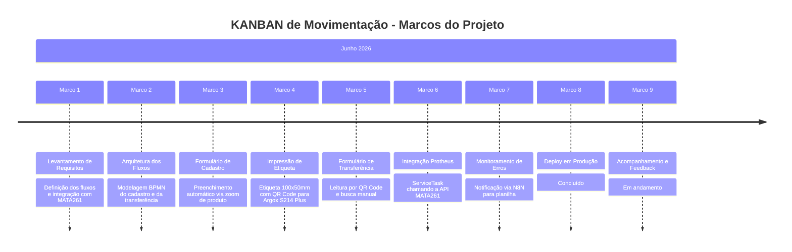

# Marcos do Projeto - KANBAN de Movimentação

> **Empresa:** Moldemaq &nbsp;|&nbsp; **Responsável TI:** Leonardo Abreu
> **Plataforma:** TOTVS Fluig Voyager (2.0.0-260224)
> **Período:** Junho de 2026

---

## De onde saímos

A movimentação de materiais entre armazéns na Moldemaq era feita de forma manual, sem rastreabilidade e sem integração direta com o estoque do Protheus. Não havia um controle físico padronizado dos cartões KANBAN e cada transferência exigia lançamento manual no ERP, sujeito a erros de digitação e retrabalho.

A empresa já possuía o **Fluig (TOTVS)** em produção, com o primeiro processo (RNC) entregue e a API REST do Protheus disponível para integração — base sobre a qual a solução foi construída.

---

## A decisão

Construir um processo no Fluig que unisse o controle físico (cartão com QR Code) à movimentação digital (transferência automática no Protheus), por dois motivos:

1. Eliminar o lançamento manual de transferências no ERP, reduzindo erros e ganhando rastreabilidade.
2. Aproveitar a mobilidade do Fluig — o operador realiza a transferência pelo celular, lendo o QR Code direto no chão de fábrica.

---

## O que foi construído

| # | Marco | Entrega |
|---|---|---|
| 1 | **Levantamento de Requisitos** | Definição dos dois fluxos (cadastro e transferência), campos do cartão e integração com a MATA261 |
| 2 | **Arquitetura BPMN** | 2 fluxos modelados no Fluig Designer: cadastro do cartão e transferência via ServiceTask |
| 3 | **Formulário de Cadastro** | `displayFields.js`, `validateForm.js` e preenchimento automático de produto/localização via zoom |
| 4 | **Impressão de Etiqueta** | Etiqueta 100x50mm com QR Code para impressora térmica Argox S214 Plus |
| 5 | **Datasets Customizados** | `ds_produtos` (com localização via JOIN na SBE010) e `ds_dados_cartao_kanban` (dados do cartão) |
| 6 | **Formulário de Transferência** | Leitura do cartão por QR Code (câmera nativa do My Fluig) ou busca manual |
| 7 | **Integração Protheus (MATA261)** | ServiceTask chamando a API REST para movimentação de estoque entre armazéns |
| 8 | **Monitoramento de Erros** | Notificação automática via N8N para registro de erros em planilha |
| 9 | **Documentação** | Manual do usuário + documentação dos marcos do projeto |

---

## Desafios Superados

**Leitura de QR Code no aplicativo móvel**
A leitura por câmera dentro do aplicativo My Fluig exigiu o uso da câmera nativa via `JSInterface.showBarcodeReader()`, já que bibliotecas web de leitura de QR Code não funcionam no contexto do app. A integração do resultado lido com o componente de zoom do Fluig exigiu testes e ajustes finos.

**Diferença de ambientes (homologação x produção)**
Os números das tabelas internas do Fluig (ML00XXXX) mudam entre homologação e produção. Foi necessário mapear as tabelas corretas em produção e ajustar os datasets para apontarem para as estruturas certas.

**Integração com API REST do Protheus**
A chamada à MATA261 exigiu tratamento de autenticação Basic Auth, desabilitação de verificação SSL para certificado autoassinado e cuidado com a tipagem dos dados enviados (quantidade como número, demais campos como texto) para que a API aceitasse a transferência.

**Calibração da etiqueta térmica**
A impressão na Argox S214 Plus exigiu ajustes de margem e tamanho de fonte para compensar a área não imprimível da impressora e garantir que nenhum dado fosse cortado.

---

## Como o desenvolvimento foi estruturado

O projeto foi dividido em **2 fluxos principais**, desenvolvidos e validados de forma incremental.

| Fluxo | Escopo |
|---|---|
| **1 — Cadastro do Cartão** | Formulário de cadastro com preenchimento automático de produto, geração do número único do cartão e impressão da etiqueta 100x50mm com QR Code. |
| **2 — Transferência de Estoque** | Leitura do cartão por QR Code ou busca manual, com chamada à API MATA261 do Protheus para executar a movimentação entre armazéns e notificação de erros via N8N. |

---

## Status atual

| Componente | Status |
|---|---|
| Workflow (2 fluxos) | Concluído |
| Formulário de cadastro + impressão de etiqueta | Concluído |
| Formulário de transferência + leitura QR Code | Concluído |
| Datasets customizados | Concluído |
| Integração Protheus (MATA261) | Concluído |
| Monitoramento de erros (N8N) | Concluído |
| Deploy em Produção | Concluído |
| **Controle de acesso e Fluxo 3 (transferência manual)** | Planejado |

---

## Linha do Tempo

