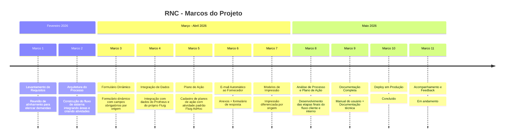

# Marcos do Projeto - RNC: Registro de Não Conformidade

> **Empresa:** Moldemaq &nbsp;|&nbsp; **Responsável TI:** Leonardo Abreu
> **Plataforma:** TOTVS Fluig Voyager (2.0.0-260224 656)
> **Período:** Fevereiro → Maio de 2026

---

## De onde saímos

A empresa não possuía nenhum processo formal para registro e rastreamento de Não Conformidades. As ocorrências internas eram gerenciadas por planilhas Excel espalhadas, sem padronização, sem rastreabilidade de custos e sem verificação de eficácia das ações corretivas.

Um protótipo havia sido criado no **AppSheet** - o "Diário de Ocorrências" - mas atendia exclusivamente ao setor de Qualidade, sem workflow, sem comunicação com fornecedores e sem cobertura das regras de negócio levantadas em reunião com as áreas de Qualidade, Indústria, Vendas e Pós-Vendas. A solução atual abrange toda a empresa.

A empresa possuía o **Fluig (TOTVS)** em produção, porém sem nenhum processo desenvolvido - uma das ferramentas disponíveis para construir a solução.

---

## A decisão

Abandonar o AppSheet e construir o processo do zero no Fluig, por dois motivos estratégicos:

1. Resolver a dor da empresa como um todo e, ao mesmo tempo, demonstrar o valor da ferramenta que a empresa já pagava.
2. O Fluig é nativo para BPM - o workflow de passagem de bastão entre áreas é exatamente o domínio da plataforma.

---

## O que foi construído

| # | Marco | Entrega |
|---|---|---|
| 1 | **Levantamento de Requisitos** | 3 origens de ocorrência (Fornecedor, Cliente, Interno), rastreabilidade por produto/lote/NF, análise de causa, plano de ação com responsável e prazo, verificação de eficácia |
| 2 | **Arquitetura BPMN** | 1 fluxo modelado no Fluig Designer com 3 caminhos por origem e 29 estados documentados |
| 3 | **Formulário HTML Dinâmico** | `displayFields.js` (visibilidade por estado) + `validateForm.js` (validações de negócio) + campos condicionais por origem |
| 4 | **Datasets Customizados** | `ds_rnc_anexos_ativos` (solução para JNDI indisponível) e `ds_planos_adhoc` (zoom da tabela de plano de ação) |
| 5 | **E-mail Automático ao Fornecedor** | HTML layout A4 com dados da RNC + anexos de imagem + formulário de resposta estruturado, enviado no estado 72 |
| 6 | **Disparo de Tarefas AdHoc** | Criação automática de tarefas individuais por responsável ao atingir o estado 173 |
| 7 | **Modelos de Impressão** | Impressão diferenciada por origem com seções condicionais (sem blocos vazios) |
| 8 | **Documentação** | Manual do usuário (por fluxo) + Documentação técnica (para devs) |

---

## Desafios Superados

**Processo sem documentação prévia**
Nenhum fluxo de não conformidade existia na empresa. Foi necessário mapear, entender e estruturar todas as regras de negócio do zero — reunindo as áreas de Qualidade, Indústria, Vendas e Pós-Vendas para alinhar expectativas e definir o processo antes de qualquer linha de desenvolvimento.

**Primeiro desenvolvimento no Fluig**
A plataforma Fluig nunca havia sido utilizada para desenvolvimento de processos na empresa. Todo o aprendizado da ferramenta — suas capacidades, limitações e melhores práticas — aconteceu de forma simultânea à construção da solução.

**Múltiplas áreas, múltiplas regras**
O processo precisou contemplar origens completamente distintas (Fornecedor, Cliente e Interno) com fluxos, validações e comunicações próprias para cada uma. Garantir que todas as áreas se reconhecessem na solução exigiu rodadas contínuas de alinhamento e ajuste.

**Entrega incremental com uso real**
A solução foi desenvolvida e entregue em fases, com usuários já utilizando partes do sistema enquanto outras ainda estavam em construção. Isso exigiu estabilidade nas entregas e capacidade de evoluir sem quebrar o que já estava em produção.

---

## Como o desenvolvimento foi estruturado

O projeto foi dividido em **4 fases principais**, cada uma com foco em uma origem de ocorrência ou etapa do processo. Essa abordagem garantiu entregas incrementais e permitiu que cada área validasse seu fluxo antes do avanço para a próxima fase.

| Fase | Escopo |
|---|---|
| **1 — RNC Fornecedor** | Primeiro fluxo desenvolvido. Cobre o ciclo completo de uma não conformidade originada na entrada de materiais: abertura, análise, tratativa com fornecedor, envio/retorno de peças, faturamento e encerramento. |
| **2 — RNC Cliente** | Extensão do fluxo para ocorrências originadas no pós-venda: atendimento técnico, reclamação e lançamento posterior de mão de obra, com comunicação direcionada entre cliente e Pós-Vendas. |
| **3 — RNC Interno** | Cobertura de ocorrências identificadas internamente, sem envolvimento de fornecedor ou cliente, integrando o solicitante ao setor de processos.|
| **4 — Análise de Processo e Plano de Ação** | Desenvolvimento das etapas transversais presentes nos três fluxos: análise de causa, criação de plano de ação com tarefas por responsável e verificação de eficácia. |

---

## Status atual

| Componente | Status |
|---|---|
| Workflow (3 fluxos, 29 estados) | Concluído |
| Formulário HTML com campos dinâmicos | Concluído |
| Automações (e-mail + AdHoc + impressão) | Concluído |
| Datasets customizados | Concluído |
| Documentação (usuário + técnica) | Concluído |
| Deploy em Produção | Concluído |
| **Monitorar primeiros registros e ajustar** | Em andamento |

---

## Linha do Tempo

